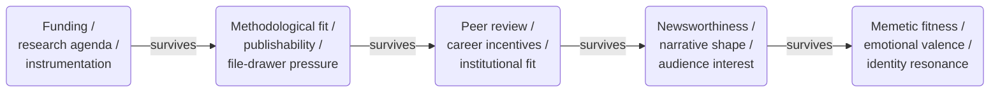

This is the diagram I keep coming back to. I drew it years ago, on a whim, to try to capture how information moves from reality to people. It's been sitting in my notes for a while, and I think it's still mostly right. But it was missing a piece, and the back half of this chapter is about that missing piece.

## The diagram

![[Pasted image 20240922201821.png]]

The idea: reality, on the left, is the source. By the time it reaches a meme on the right, it has been transformed five times, each transformation a kind of abstraction or compression. Most of what we encounter day-to-day lives somewhere on the right side of this diagram, multiple steps removed from whatever happened in the world.

Each arrow is doing real work. The work each arrow does is what the next several sections are about.

## The Out There

Reality. The world as it is, independent of any observer. Atoms, energy, events, social relationships, the temperature outside, the actual unemployment rate, the actual number of people who voted, the state of the climate, what was actually said in that meeting. We never interact with this directly. Every interaction with reality is mediated by something: instruments, observation, language, memory.

The Out There is the source. It's also the only node on this diagram we can never see clearly. Everything else, we have at least some access to.

In Harari's terms from [[nexus-book]], this is roughly objective reality. One of the threads this book will pull on is that we systematically underestimate how much of what we think of as objective reality is actually downstream of this node, already abstracted, already curated, already memed, by the time we receive it.

## Measurement → Raw Data

The first abstraction. Every measurement is a choice: what to measure, at what resolution, with what instruments, under what conditions. Each measurement is already a compression. You've chosen one slice of reality and ignored everything else.

A thermometer gives you a number. The number is the temperature. The temperature is the average kinetic energy of molecules in a region. The region is a choice. The average is a choice. The choice to measure temperature rather than humidity, pressure, particulate density, or light spectrum is a choice. The reading is a number; the reality is a continuum.

This generalizes. A poll of voter preference is a measurement. The questions are choices. The respondents are a sample. The response options are constrained. What's lost: every preference that doesn't fit the questions, every voter who didn't respond, every nuance the response options couldn't capture. What's gained: a structured artifact other people can analyze.

Raw data is misnamed. The "raw" is the first compression, pretending to be the source.

## Analysis → Insight

Patterns. Relationships. Models. Statistics. Inference. An insight is a claim about what the data means: this correlates with that, this trend is real, this mechanism explains the pattern.

Insights are interpretive. The same data, analyzed by two researchers with different frameworks, produces different insights. Sometimes contradictory ones. The choice of analytical framework is itself a compression: you've decided what kinds of claims are allowed before you've looked at the data.

What's lost: alternative interpretations, data that didn't fit the framework, statistical noise that might have been signal under a different lens. What's gained: a claim with explanatory or predictive power.

Worth saying out loud: most insights are wrong. Even careful analysis produces claims that don't replicate, don't generalize, or were artifacts of the particular dataset. The pipeline is leaky on purpose at this stage. We're hoping the next stage catches the errors.

## Consensus → Theory

The process by which a community of practitioners decides which insights are load-bearing enough to build on. Peer review. Replication. Debate. Argument. Eventually agreement, or persistent disagreement that creates competing schools.

A theory is what survives that process. It's a framework that connects many insights into a coherent structure: gravitation, evolution, supply and demand, structural racism, climate change. Theories are the best current synthesis a field has arrived at, not Truth (capital T). They get revised. Sometimes they get overthrown entirely.

What's lost: insights that didn't survive scrutiny, dissenting positions that didn't win consensus, the precise edge cases where the theory might break. What's gained: a transferable framework that other practitioners can use without re-deriving everything from raw data.

This stage is where institutional carriers do their work. Peer review is here. Replication is here. The whole apparatus of academic publishing, conferences, citations, textbooks, curricula. All of it exists to do the consensus-formation work that turns insights into theory.

It's also the slowest, most expensive stage. A theory takes years or decades to form. Most insights never get there.

## Abstraction/Curation → News/Journalism

Translation from specialist language to general language. A journalist decides what's newsworthy, what context to give, what to emphasize, what to omit. The output is a narrative aimed at readers who don't share the preconditions of the original theory.

This is where the abstraction starts to bite. A theory has internal structure that's load-bearing: qualifications, uncertainty, scope conditions, dependencies on other theories. A news article has none of that infrastructure. The journalist has to choose which parts of the structure to preserve in the translation, which parts to drop, and what frame to put around it.

The honest version of this is hard. The dishonest version is easy. The honest version says "this is what we think we know, with these qualifications, and here's why it might be wrong." The dishonest version says "scientists say X." The dishonest version travels.

What's lost: technical precision, qualifications, uncertainty quantification, the underlying framework's full structure, often the source itself. What's gained: accessibility to a much larger audience.

## Abstraction/Emote → Meme

The final compression. News becomes a shareable, emotionally-charged unit that can travel through informal networks. A meme. A slogan. A cultural reference. A vibe.

The version that survives at this stage is the one with the highest fitness against the attention economy. Whatever it has to do — anger you, validate you, make you laugh, make you feel like part of an in-group — is the work it has to do to keep moving.

By the time something has become a meme, it's usually about something other than the original theory. It's about identity. It's about tribe. It's about what kind of person you are if you believe it or share it. The original theory might still be in there somewhere, but it's no longer the load-bearing part. The load-bearing part is what the meme does for the receiver.

What's lost: nuance, qualifications, source attribution, the original claim itself. What's gained: maximum transmissibility.

## What the pipeline view alone misses

So that's the transport pipeline. Each stage is a re-encoding. Each transformation is lossy. By the time you reach the right side of the diagram, very little of the original is left.

But the transport pipeline alone is incomplete. It tells you what *happens to* information as it moves through abstraction layers. It does not tell you what gets to move.

At each stage, vast amounts of content fail to advance at all. Most measurements are never taken. Most data is never analyzed. Most analyses are never published. Most papers are never integrated into theory. Most theories never make it into news. Most news never becomes meme.

What survives each stage is determined by criteria that have very little to do with truth and a lot to do with the local fitness landscape of that stage. The transport pipeline is misleading on its own because it makes you think the question is "how does information get compressed as it travels." The deeper question is "what survives the selection gates the information has to pass through."

This is where the sibling pipeline comes in.

## The sibling pipeline: selection

Parallel to the transport pipeline, there's a pipeline of *selection events*. At each stage of the transport pipeline, content faces a gate. Most content fails the gate. Some survives. The criteria at each gate are different, and they reflect what that stage cares about.

That's the rough shape. Walking through it stage by stage:

**Selection at measurement.** What gets measured at all? Funding agencies decide. Research agendas decide. Available instrumentation decides. Career incentives decide. The vast unmeasured is invisible to us. We see only the slices of reality someone selected to make data of. This is the first and most consequential gate. Anything that never becomes data doesn't enter the rest of the pipeline.

**Selection at analysis.** Which patterns get pursued? Publication bias toward positive results. Methodological fashions. Theoretical frameworks that exclude certain hypotheses. Data that doesn't support a publishable claim often gets quietly shelved. The phrase "the file drawer problem" exists because so much of analysis fails this gate.

**Selection at consensus.** Which insights become theory? Peer review. Career incentives. Institutional gatekeeping. What "the field" decides is important. Dissenting positions can be technically correct and still get filtered out for not being load-bearing in the dominant framework. Theories get adopted when they explain things people already wanted explained.

**Selection at curation.** What gets reported as news? Newsworthiness. Narrative shape. Audience interest. What advertisers tolerate. What clicks. The theory or event has to fit a story before it can become news, and most theories don't have story-shaped versions of themselves available.

**Selection at emote.** Which news survives in informal networks? Memetic fitness. Emotional valence. Identity resonance. Tribal signaling. The news has to do work for the receiver (entertainment, identity, anger, hope, fear) before it can become culture. News that doesn't do work for receivers sits in the news cycle for a day and disappears.

Each set of criteria is local to its stage. None of them are coordinated. None of them are particularly interested in truth-preservation as a primary goal. Each one optimizes for its own local fitness landscape: getting funded, getting published, getting cited, getting clicked, getting shared.

## How the two pipelines fit together

The two pipelines work in series at each stage. Content faces selection first: does it survive the gate? Then compression: does it fit the next medium? Sometimes the order reverses (content gets reshaped to pass selection, which is what advocacy and PR do). Sometimes they happen simultaneously. The point is both are operating, and the output of each stage is a small fraction of the input, in heavily transformed form.

A consequence: if you only model transport, you over-estimate how much information actually moves. The pipeline looks like a continuous (if lossy) flow. With selection added, the pipeline looks like a series of bottlenecks, each one discarding most of what it receives. The funnel is much narrower than the transport view suggests.

Another consequence: the criteria at each gate are tunable. You can change what gets measured by changing funding priorities. You can change what gets published by changing review criteria. You can change what becomes news by changing editorial standards. You can change what becomes meme by changing platform mechanics. The criteria are institutional choices, made by people, embedded in technologies and incentive structures. They're not laws of nature.

Most of the prescriptive work in the rest of this book is downstream of that observation. If the gates are institutional choices, the gates can be redesigned. The question is who's doing the redesigning, with what criteria, in what medium.

## Where the medium fits

Each stage has a medium: a specific technology, institution, or platform through which content moves. Scientific instruments. Papers. Journals. Newspapers. Broadcast networks. Social media platforms. Each medium has its own affordances and constraints, and each medium imposes its own selection criteria on the content moving through it.

A medium that rewards engagement-bait produces engagement-bait. A medium that requires citations produces citation-fluent content. A medium with peer review produces peer-reviewed content. The medium is the upstream cause of the selection criteria at a given stage, not a downstream effect of them. Different media expose different selection criteria, and the content that survives in one medium would not survive in another.

This is a thread the book picks up later. For now, the point is: every node and every arrow in this two-pipeline picture has a medium attached to it. The selection criteria at each gate are downstream of what that medium can hold and what it rewards. Changing the medium changes the criteria. The pipeline operates inside a specific media ecosystem, and the ecosystem is doing most of the work.

## Where manufactured content enters

The diagram has The Out There as the source. Everything else descends from it. That's the cleanest version of the picture, and it's wrong for a substantial chunk of what circulates as information.

A lot of content is manufactured. Generated wholesale, never measured against anything in particular, and injected into the pipeline at later stages. Astrology is the canonical example. The astronomical positions involved are real measurements. The interpretive framework that turns those positions into personality claims and predictions was invented. It didn't survive peer review at the consensus stage, because it never went through that stage. It got injected directly at the curation stage (horoscope columns in newspapers, daily app readings) and at the meme stage (sun sign discourse, "as a Scorpio…").

This generalizes. Religious doctrines about how reality works. Conspiracy theories. Marketing claims. Political propaganda. AI-generated text. Folk wisdom with no empirical grounding. Manufactured statistics passed around without sources. All of these can enter the pipeline without ever passing through measurement, and once in, they're subject to the same selection pressures and compressions as anything else.

The implication is that downstream selection criteria can't easily tell measured content from manufactured content. A horoscope and a peer-reviewed psychological finding look about the same shape by the time they reach a reader's attention. Both are short, both make claims about the reader's life, both fit a narrative. The newsworthiness gate doesn't ask "did this come from data?" It asks "will this get clicked?" The same goes for the memetic gate, the curation gate, and in some cases the consensus gate. Fields exist where manufactured frameworks won consensus and then propagated through the same channels as anything else.

So the diagram needs a softer claim. The Out There is *a* source, not *the* source. Manufactured content is the other source. Most content is some mixture: real astronomical positions plus invented framework, real medical observation plus invented mechanism, real economic data plus invented causal story. The pipeline doesn't distinguish between the components.

This is one of the threads that connects to the truth-value question (slated for Chapter 5c). The truth value of a piece of content depends partly on what the manufactured component is doing: preserving approximate truth, inverting it, or wandering off into orthogonal territory. Astrology inverts (planetary positions don't cause personality traits). Some folk medicine preserves (remedies that work for reasons people didn't understand). AI-generated content can do any of the three, depending on what it's trained on and what it's asked.

## A note on feedback loops

The pipeline I just walked through is linear. The reality it represents is messier. Memes feed back into what research gets funded, since "interesting" topics follow cultural attention. News shapes what consensus forms around (climate science took the form it did partly because of how it was being reported on). Theories shape what we choose to measure (we measure GDP because economic theory said GDP matters, and we measure it differently in different decades because economic theory changed). Selection criteria at one stage propagate backward and affect what gets done at earlier stages.

I left those out to keep the chapter tractable. The cost is that the picture looks more orderly than reality. The benefit is that the core structure (transport + selection at each stage) stays visible. A messier diagram with feedback arrows in every direction might be more accurate but would obscure the structure I'm trying to show.

Some of these feedback loops will surface naturally in the case studies in Chapter 2. Others will show up in Part III when the bridge zone gets its own treatment. For now, just keep in mind that the diagram is a simplification of a tangled system, not a map of how reality actually moves.

## What this sets up

The rest of Part I goes deeper into what gets lost (and what gets selected) at each stage. Part II asks why this arrangement is structurally unavoidable. Part III is about the bridge zone where most of the catastrophic distortion happens. Part IV is about what to do about it.

But the core picture is here. Reality on one side, memes on the other, five stages of transformation in between, each stage doing both compression and selection. We never see The Out There directly. We see whatever survives the gates and arrives in whatever shape the medium of that arrival allows. The book is partly about how to be more honest about that, and partly about how to build infrastructure that does better than what we have now.
