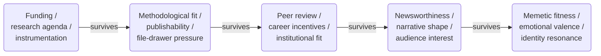

If you've ever watched a careful finding get flattened into a headline, and then into a meme that means almost the opposite, this is the map of how that happens. I drew the diagram below years ago to trace the path an idea takes from the world to a person. I still think it's mostly right. It was missing a piece, and the back half of this chapter is about the piece. No special background needed; I'll build each part as we go.

## The diagram

![[Pasted image 20240922201821.png]]

```mermaid
flowchart LR
    void([The Out There])
    data[Raw Data]
    insight[Insight]
    theory[Theory]
    news[News/Journalism]
    meme[Meme]

    void -->|Measurement| data
    data -->|Analysis| insight
    insight -->|Consensus| theory
    theory -->|Abstraction/Curation| news
    news -->|Abstraction/Emote| meme
```

Reality is on the left. By the time it reaches a meme on the right it has been transformed five times, each transformation a kind of abstraction or compression. Most of what we meet day to day lives somewhere on the right, several steps removed from whatever happened in the world. Each arrow does real work, and the next several sections are about the work each one does.

## The Out There

Reality. The world as it is, independent of any observer: atoms, events, the actual unemployment rate, what was actually said in that meeting. We never touch it directly. Every interaction with reality is mediated by something: instruments, observation, language, memory.

The Out There is the source. It is also the only node on this diagram we can never see clearly; everything else we have at least some access to. In Harari's terms from [[nexus-book|Nexus]], this is roughly objective reality. One thread this book pulls on is that we systematically underestimate how much of what we think of as objective reality is actually downstream of this node, already abstracted, already curated, already memed, by the time we receive it.

## Measurement → Raw Data

The first abstraction. Every measurement is a choice: what to measure, at what resolution, with what instruments, under what conditions. A thermometer gives you a number. The number is the temperature. The temperature is the average kinetic energy of molecules in a region. The region is a choice, the average is a choice, and the choice to measure temperature rather than humidity or particulate density is a choice. The reading is a number; the reality is a continuum.

This generalizes. A poll of voter preference is a measurement: the questions are choices, the respondents are a sample, the response options are constrained. What's lost is every preference that didn't fit the questions; what's gained is a structured artifact other people can analyze. Raw data is misnamed. The "raw" is the first compression, pretending to be the source.

## Analysis → Insight

Patterns, relationships, models, inference. An insight is a claim about what the data means: this correlates with that, this mechanism explains the pattern. Insights are interpretive. The same data, analyzed by two researchers with different frameworks, produces different insights, sometimes contradictory ones, because the choice of framework decides what kinds of claims are allowed before anyone looks at the data.

Worth saying out loud: most insights are wrong. Even careful analysis produces claims that don't replicate, don't generalize, or were artifacts of one dataset; the case that most published findings in some fields are false is Ioannidis's (2005). The pipeline is leaky on purpose here. We're hoping the next stage catches the errors.

## Consensus → Theory

The process by which a community of practitioners decides which insights are load-bearing enough to build on: peer review, replication, debate, eventually agreement or a persistent disagreement that spawns competing schools. A theory is what survives that process, a framework connecting many insights into a coherent structure: gravitation, evolution, supply and demand, climate change. Theories are the best current synthesis a field has, not Truth with a capital T; they get revised, and sometimes overthrown.

This stage is where institutional carriers do their work: peer review, replication, and the whole apparatus of publishing, conferences, citations, and curricula, all of it turning insights into theory. It is also the slowest and most expensive stage. A theory takes years or decades to form, and most insights never get there.

## Abstraction/Curation → News

Translation from specialist language to general language. A journalist decides what's newsworthy, what context to give, what to emphasize, what to omit, for readers who don't share the preconditions of the original theory. This is where the abstraction starts to bite. A theory has load-bearing internal structure (qualifications, scope conditions, dependencies), and a news article has none of that infrastructure, so the journalist has to choose which parts survive the translation and what frame to put around the rest.

The honest version of this is hard and the dishonest version is easy. The honest version says "this is what we think we know, with these qualifications, and here's why it might be wrong." The dishonest version says [[scientists-say-x|"scientists say X."]] The dishonest version travels.

## Abstraction/Emote → Meme

The final compression. News becomes a shareable, emotionally charged unit that can travel through informal networks: a meme, a slogan, a vibe. The version that survives has the highest fitness against the attention economy, and whatever it does for the receiver (anger, validation, a laugh, a sense of belonging) is the work it has to do to keep moving.

By the time something is a meme it is usually about something other than the original theory. It's about identity, about tribe, about what kind of person you are if you believe it. The original theory may still be in there, but it is no longer the load-bearing part. The load-bearing part is what the meme does for the receiver.

## The sibling pipeline: selection

That's transport: five re-encodings, each one lossy. But transport only tells you what happens to information that moves. It says nothing about what gets to move at all, and at every stage most content fails to advance. Most measurements are never taken, most data is never analyzed, most papers never become theory, most theories never become news, most news never becomes a meme. What survives each hop is decided by criteria local to that hop, and almost none of them are about truth. That is the second pipeline: parallel to transport, a pipeline of selection events, one gate per stage.

```mermaid
flowchart LR
    m1(Funding /<br/>research agenda /<br/>instrumentation)
    m2(Methodological fit /<br/>publishability /<br/>file-drawer pressure)
    m3(Peer review /<br/>career incentives /<br/>institutional fit)
    m4(Newsworthiness /<br/>narrative shape /<br/>audience interest)
    m5(Memetic fitness /<br/>emotional valence /<br/>identity resonance)

    m1 -->|survives| m2
    m2 -->|survives| m3
    m3 -->|survives| m4
    m4 -->|survives| m5
```

Each gate applies its own test, and the tests are local and uncoordinated. **Selection at measurement**: funding, research agendas, and available instruments decide what becomes data at all, and the vast unmeasured never enters the pipeline. **Selection at analysis**: publication bias toward positive results, and data that won't support a publishable claim gets shelved, which is why the "file drawer problem" has a name (Rosenthal, 1979). **Selection at consensus**: peer review and institutional gatekeeping, where a dissenting position can be technically correct and still filtered out for not being load-bearing in the dominant framework. **Selection at curation**: newsworthiness, narrative shape, and what advertisers tolerate; a theory has to have a story-shaped version of itself before it can become news, and most don't. **Selection at emote**: [[memetic-fitness|memetic fitness]], emotional valence, identity resonance; news that does no work for receivers disappears in a day. None of these criteria is coordinated with the others, and none is much interested in truth.

## How the two pipelines fit together

At every stage both run. Content has to pass the gate, then fit the next medium. Sometimes it's reshaped in advance to pass the gate, which is what advocacy and PR do; sometimes the two happen at once. The point is both are operating, and the output of each stage is a small fraction of the input, in heavily transformed form. Model transport alone and you picture a lossy but continuous flow. Add selection and you picture a series of bottlenecks, each discarding most of what it receives, and the second picture is the right one.

A second consequence: the criteria at each gate are *tunable*. You can change what gets measured by changing funding, what gets published by changing review criteria, what becomes news by changing editorial standards, what becomes a meme by changing platform mechanics. The criteria are institutional choices embedded in technologies and incentives, not laws of nature, and most of the prescriptive work later in the book is downstream of that one observation. If the gates are choices, the gates can be redesigned. The question is who does the redesigning, with what criteria, in what medium.

## Where the medium fits

Each stage has a medium: a specific technology or institution content moves through. Scientific instruments, journals, newspapers, broadcast networks, social platforms. A medium that rewards engagement-bait produces engagement-bait; a medium that requires citations produces citation-fluent content. The medium is the upstream cause of a stage's selection criteria, not a downstream effect of them. For now, the point is: every node and every arrow in this two-pipeline picture has a medium attached to it. The selection criteria at each gate are downstream of what that medium can hold and what it rewards. Change the medium and you change the criteria.

## Where manufactured content enters

The diagram has The Out There as the source, and everything descends from it. That's the clean version, and it's wrong for a large share of what circulates. A lot of content is [[manufactured-injection|manufactured]]: generated wholesale, never measured against anything, and injected at a later stage. [[astrology|Astrology]] is the canonical case. The astronomical positions are real measurements; the framework that turns them into personality claims was invented, never passed a consensus gate, and got injected directly at curation (the horoscope column) and at the meme stage ("as a Virgo…"). The same goes for conspiracy theories, marketing claims, propaganda, AI-generated text, and manufactured statistics passed around without sources.

The point is that downstream gates can't easily tell measured content from manufactured. A horoscope and a peer-reviewed finding are about the same shape by the time they reach a reader: short, about the reader's life, story-fitting. The newsworthiness gate doesn't ask "did this come from data?" It asks "will this get clicked?" So the diagram needs a softer claim: The Out There is *a* source, not *the* source. Most content is a mixture, real astronomical positions plus invented framework, real economic data plus invented causal story, and the pipeline doesn't distinguish the components. Whether a manufactured component preserves approximate truth, inverts it, or wanders off into orthogonal territory is the [[truth-value-placement|truth-value question]] Chapter 5c takes up.

## A note on feedback loops

The pipeline I just walked is linear; the reality is messier. Memes feed back into what gets funded, since "interesting" topics follow cultural attention. News shapes what consensus forms around. Theories shape what we choose to measure (we measure GDP because economic theory said GDP matters). Selection criteria at one stage propagate backward and change what gets done at earlier ones. I left the feedback arrows out to keep the core structure (transport plus selection at each stage) visible, at the cost of making the picture look more orderly than it is. Keep in mind that the diagram is a simplification of a tangled system.

## What this sets up

That's the core picture. Reality on one side, memes on the other, five hops in between, each hop compressing and selecting. We never see The Out There directly; we see what survived the gates, in whatever shape the medium it arrived through allows. The rest of Part I goes deeper into what gets lost and selected at each stage, Part II into why the arrangement is structurally unavoidable, Part III into the bridge zone where the worst distortion happens, and Part IV into what to do about it. The book is partly about being honest about that picture, and partly about building infrastructure that does better than what we have.

---

[[index|← Home]] · [[case-studies-and-three-realities|Chapter 2: Case Studies and Three Realities →]]
